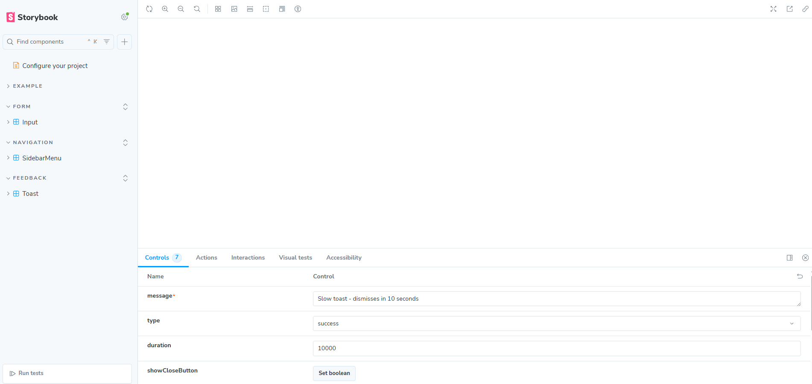
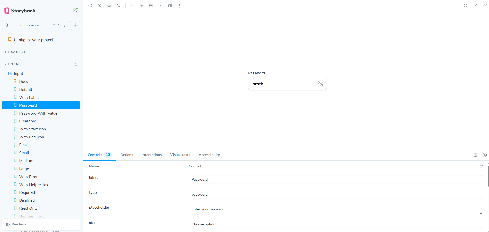
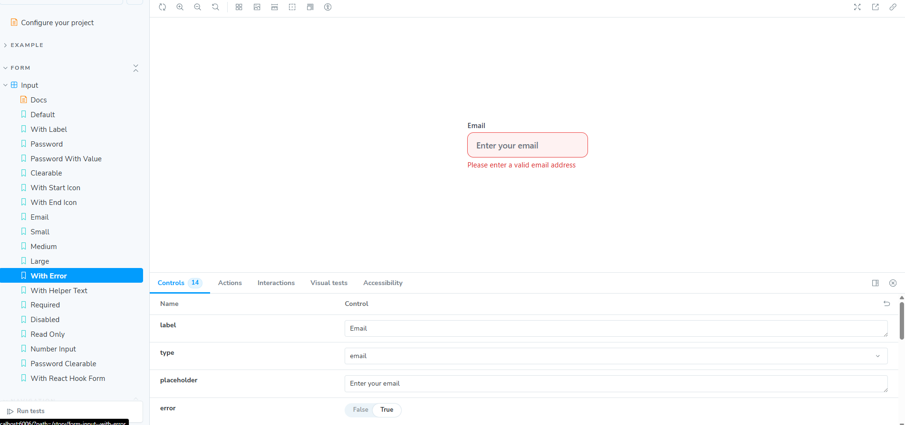
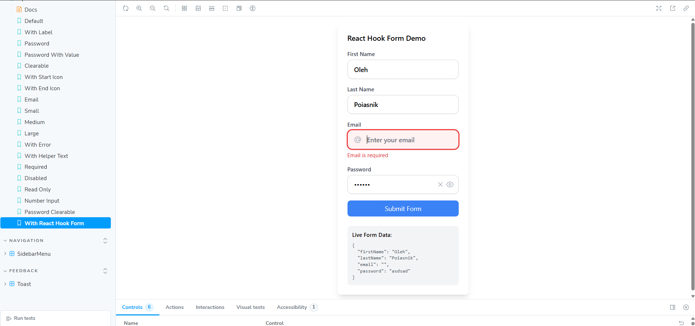
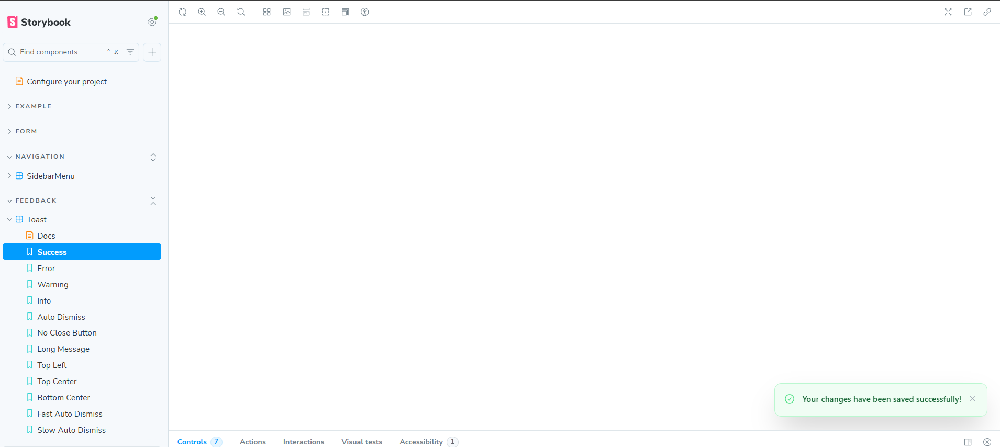
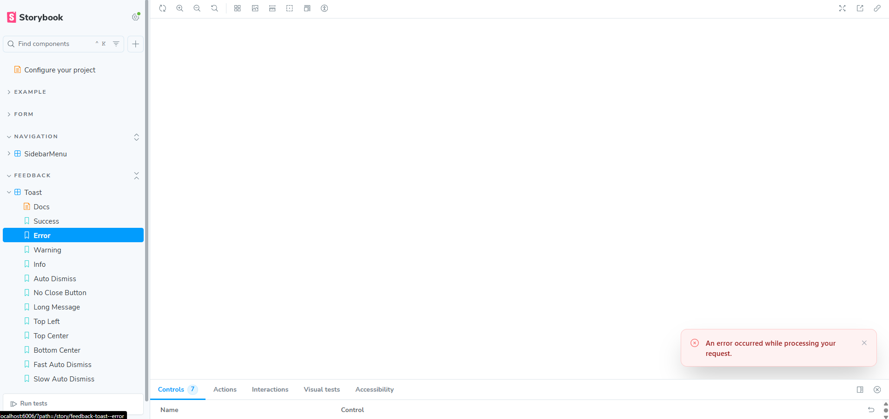
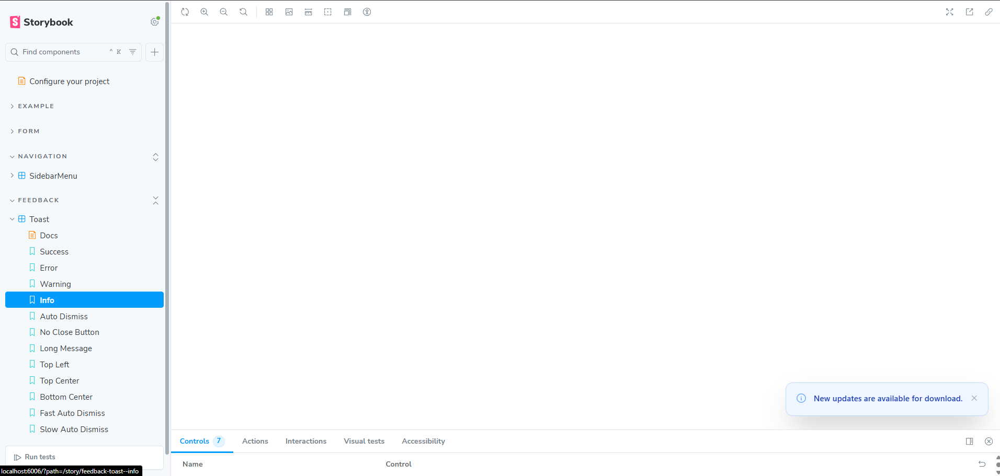
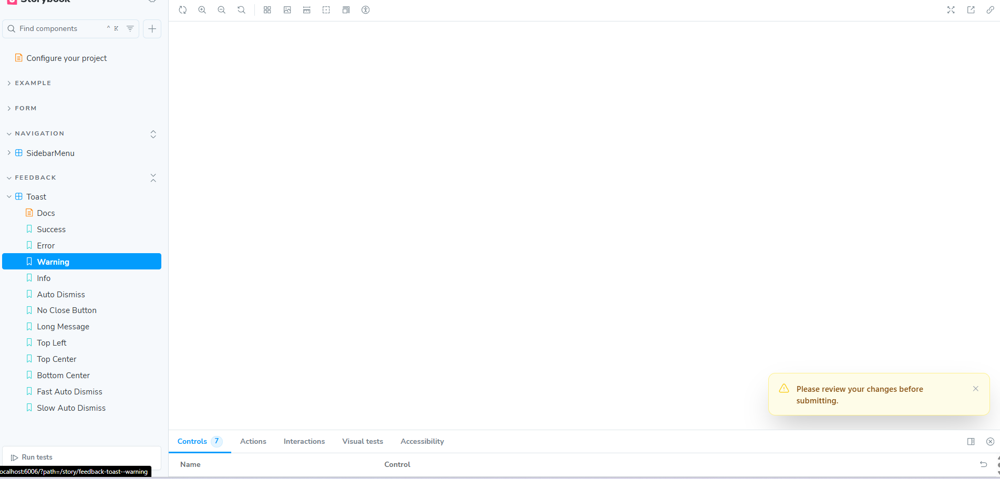
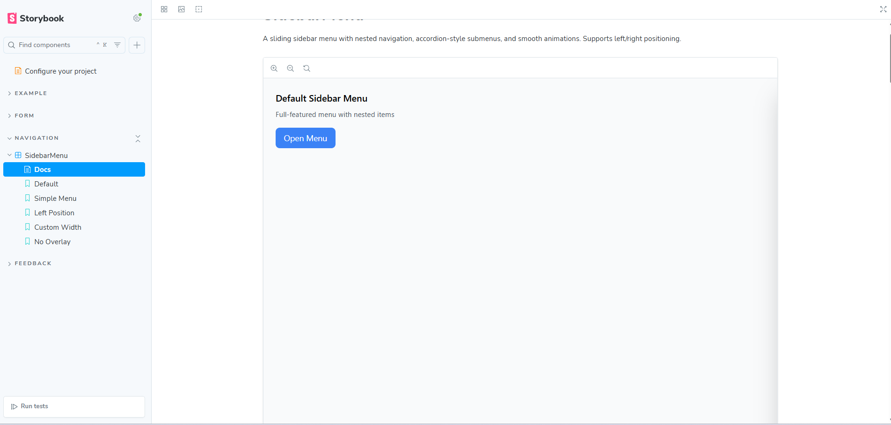
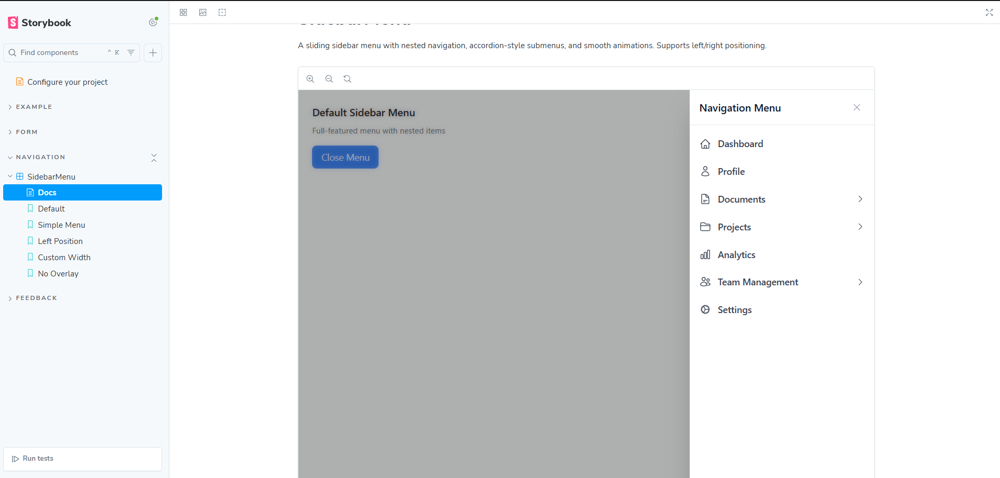

# React Component Library

A modern, accessible React component library built with **TypeScript**, **Tailwind CSS**, and **Storybook**. This library provides three essential UI components: Input, Toast, and SidebarMenu.


## 🚀 Features

- **TypeScript Support** - Full type safety and excellent developer experience
- **Tailwind CSS** - Utility-first styling with consistent design tokens
- **Storybook Integration** - Interactive component documentation and testing
- **Accessibility** - ARIA-compliant components with keyboard navigation
- **Modern React** - Built with React 19+ and modern hooks
- **ESLint + Prettier** - Code quality and consistent formatting

## 📦 Components

### 🔤 Input Component

A versatile input component with multiple variants and enhanced functionality.

**Features:**
- Password visibility toggle with eye icon
- Clearable input with X button
- Multiple sizes (sm, md, lg)
- Start and end icons support
- Error states with validation messages
- Helper text and labels
- Disabled and read-only states


### 🔔 Toast Component

A notification toast component with smooth animations and auto-dismiss functionality.

**Features:**
- Multiple types: success, error, warning, info
- Auto-dismiss with customizable duration
- Manual close button option
- Multiple positioning options
- Smooth fade and slide animations
- Accessible with ARIA live regions


### 📚 Sidebar Menu Component

A sliding sidebar menu with nested navigation and accordion-style submenus.

**Features:**
- Slides in from left or right
- Nested menu items with unlimited depth
- Accordion-style expandable submenus
- Overlay backdrop with click-to-close
- Keyboard navigation (ESC key)
- Customizable width and positioning
- Icons support for menu items


## 🛠️ Setup Instructions

### Prerequisites

- Node.js 20.12.0 or higher
- npm 10.5.0 or higher

### Installation

1. **Clone the repository:**
   ```bash
   git clone <repository-url>
   cd react-component-library
   ```

2. **Install dependencies:**
   ```bash
   npm install
   ```

3. **Start Storybook:**
   ```bash
   npm run storybook
   ```

4. **Open your browser:**
   Navigate to `http://localhost:6006` to view the component library.

### Development Scripts

```bash
# Start development server
npm run dev

# Build for production
npm run build

# Run Storybook
npm run storybook

# Build Storybook for deployment
npm run build-storybook

# Lint code
npm run lint

# Fix linting issues
npm run lint:fix

# Format code with Prettier
npm run format

# Check formatting
npm run format:check

# Run tests
npm run test
```

## 🧩 Usage Examples

### Input Component

```tsx
import { Input } from './components';

// Basic input
<Input 
  label="Username" 
  placeholder="Enter username" 
/>

// Password input with toggle
<Input 
  label="Password"
  type="password"
  placeholder="Enter password"
/>

// Clearable input with icon
<Input 
  label="Search"
  placeholder="Search users..."
  clearable
  startIcon={<MagnifyingGlassIcon />}
/>

// Input with error state
<Input 
  label="Email"
  type="email"
  error
  errorMessage="Please enter a valid email"
  value="invalid-email"
/>
```

### Toast Component

```tsx
import { Toast } from './components';

// Success toast
<Toast 
  message="Changes saved successfully!"
  type="success"
  duration={5000}
/>

// Error toast with manual close
<Toast 
  message="Failed to save changes"
  type="error"
  showCloseButton
  duration={0}
/>

// Positioned toast
<Toast 
  message="Welcome back!"
  type="info"
  position="top-center"
/>
```

### Sidebar Menu Component

```tsx
import { SidebarMenu } from './components';

const menuItems = [
  {
    id: 'dashboard',
    label: 'Dashboard',
    icon: <HomeIcon />,
    onClick: () => navigate('/dashboard'),
  },
  {
    id: 'settings',
    label: 'Settings',
    icon: <CogIcon />,
    children: [
      {
        id: 'profile',
        label: 'Profile Settings',
        onClick: () => navigate('/settings/profile'),
      },
      {
        id: 'security',
        label: 'Security',
        onClick: () => navigate('/settings/security'),
      },
    ],
  },
];

<SidebarMenu 
  items={menuItems}
  isOpen={sidebarOpen}
  onClose={() => setSidebarOpen(false)}
  title="Navigation"
/>
```

## 📁 Project Structure

```
src/
├── components/
│   ├── Input/
│   │   ├── Input.tsx
│   │   └── index.ts
│   ├── Toast/
│   │   ├── Toast.tsx
│   │   └── index.ts
│   ├── SidebarMenu/
│   │   ├── SidebarMenu.tsx
│   │   └── index.ts
│   └── index.ts
├── stories/
│   ├── Input.stories.tsx
│   ├── Toast.stories.tsx
│   └── SidebarMenu.stories.tsx
└── index.css
```

## 🎨 Styling

The library uses **Tailwind CSS** for styling with custom utility classes defined in `src/index.css`:

- `.input-base` - Base input styling
- `.input-error` - Error state styling
- `.toast-base` - Base toast styling
- `.sidebar-overlay` - Sidebar overlay backdrop
- `.sidebar-panel` - Sidebar panel styling

Custom animations are configured in `tailwind.config.js`:
- `slide-in-right` / `slide-out-right` - Sidebar animations
- `fade-in` / `fade-out` - Toast animations

## 🧪 Testing

The project includes Vitest integration through Storybook for component testing:

```bash
# Run tests
npm run test

# Run tests with coverage
npm run test -- --coverage
```

## 📸 Screenshots

### 🎨 Storybook Interface

*Complete component library interface with categorized stories*

### 📝 Input Component Variants
| Basic Input | Password Input | Number Input |
|-------------|----------------|--------------|
|  |  |  |
| *Standard text input with icons and validation* | *Password input with visibility toggle* | *Number input with improved sizing* |

### 🔔 Toast Notifications  
| Success Toast | Error Toast |
|---------------|-------------|
|  |  |
| *Success notification with Framer Motion* | *Error notification with smooth animations* |

| Info Toast | Warning Toast |
|------------|---------------|
|  |  |
| *Information notification* | *Warning notification* |

### 🧭 Sidebar Menu Component
| Closed State | Open State |
|--------------|------------|
|  |  |
| *Collapsed sidebar with trigger button* | *Expanded sidebar with nested navigation* |

## 🔧 Configuration

### TypeScript

The project uses strict TypeScript configuration with proper type exports for all components.

### ESLint + Prettier

Code quality is maintained with:
- ESLint for code linting
- Prettier for code formatting
- Storybook-specific rules
- React hooks linting

### Accessibility

All components follow accessibility best practices:
- Proper ARIA labels and roles
- Keyboard navigation support
- Screen reader compatibility
- Focus management

## 🚀 Deployment

To deploy Storybook:

```bash
# Build Storybook for production
npm run build-storybook

# The static files will be in storybook-static/
# Deploy this folder to your hosting service
```

## 🤝 Contributing

1. Fork the repository
2. Create a feature branch
3. Make your changes
4. Add tests if applicable
5. Run linting and formatting
6. Submit a pull request

## 📄 License

This project is licensed under the MIT License.

---

**Built with ❤️ using React, TypeScript, Tailwind CSS, and Storybook**
